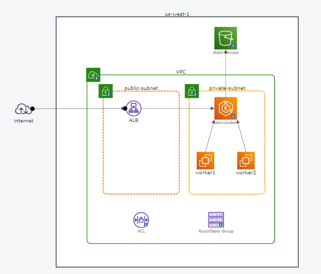

## **Guía de Despliegue en AWS con Terraform**

### **Índice**

1. Pre-requisitos
2. Configuración de AWS CLI
3. Estructura del Proyecto
4. Modificación de Variables
5. Despliegue de Infraestructura con Terraform
6. Configuración de Networking
7. Creación y Administración del Cluster EKS
8. Configuración de CI/CD con AWS CodeBuild y CodeCommit
9. Acceso y Administración
10. Best Practices y Recomendaciones
11. Diagrama de arquitectura

### **1. Pre-requisitos**

- Una cuenta activa en AWS.
- Permiso de administrador o permisos suficientes en AWS para crear y administrar recursos.
- AWS CLI instalado.
- Terraform instalado.
- Conocimientos básicos de Terraform y AWS.

### **2. Configuración de AWS CLI**

1. Abre tu terminal o línea de comandos.
2. Ejecuta `aws configure`.
3. Ingresa tu `AWS Access Key ID` y `AWS Secret Access Key`.
4. Selecciona tu región predeterminada (por ejemplo, `us-west-1`).
5. Selecciona el formato de salida (recomendado: `json`).

### **3. Estructura del Proyecto**

El proyecto de Terraform está estructurado en módulos y configuraciones. Los principales directorios y archivos incluyen:

- `main.tf`: Este es el archivo principal donde se define la configuración de Terraform.
- `variables.tf`: Aquí se declaran todas las variables utilizadas en el proyecto.
- `modules/`: Este directorio contiene todos los módulos que se utilizan, como el módulo de EKS y el módulo de Networking.

### **4. Modificación de Variables**

Antes de aplicar la configuración, revisa y modifica las variables en `variables.tf` según tus necesidades. Es esencial asegurarse de que las CIDR blocks, las regiones y otros valores sean correctos para tu entorno.

### **5. Despliegue de Infraestructura con Terraform**

1. Navega al directorio del proyecto en tu terminal.
2. Ejecuta `terraform init` para inicializar el directorio.
3. Ejecuta `terraform plan` para ver un resumen de los cambios propuestos.
4. Si todo parece correcto, ejecuta `terraform apply` y confirma la creación de recursos.

### **6. Configuración de Networking**

Es esencial tener una configuración adecuada de VPC, subnets y grupos de seguridad para que los recursos de AWS puedan comunicarse correctamente. Revisa la [explicación detallada del módulo de networking](networking_module_explanation.md) para entender cómo están configurados estos elementos y cómo interactúan entre sí.

### **7. Creación y Administración del Cluster EKS**

Una vez configurada la red, puedes crear y administrar tu cluster EKS. Asegúrate de tener configurados correctamente los grupos de nodos y otros recursos asociados al cluster.

### **8. Configuración de CI/CD con AWS CodeBuild y CodeCommit**

1. Crea un nuevo repositorio en AWS CodeCommit.
2. Clona este repositorio localmente y configura tu proyecto de Terraform para usarlo.
3. Configura AWS CodeBuild para usar este repositorio y crear un pipeline de CI/CD.
4. Asegúrate de que tu archivo `buildspec.yml` esté configurado correctamente para instalar las dependencias necesarias, como Terraform, y ejecutar los comandos de despliegue.

### **9. Acceso y Administración**

Una vez que todo esté desplegado, puedes acceder a tus recursos en AWS a través de la consola de AWS, AWS CLI o herramientas específicas como `kubectl` para EKS.

### **10. Best Practices y Recomendaciones**

- Monitorea regularmente tus recursos en AWS para evitar costos inesperados.
- Utiliza herramientas de administración de infraestructura como código (IaC) para mantener un registro de tus configuraciones y cambios.
- Asegúrate de seguir las mejores prácticas de seguridad, como restringir el acceso a tus recursos solo a las IP necesarias y usar grupos de seguridad adecuados.

### **11. Diagrama de arquitectura**

Este diagrama representa la arquitectura de nuestra infraestructura en AWS. A continuación, se explican los componentes clave:

VPC (Virtual Private Cloud): La Virtual Private Cloud es el entorno de red aislado en el que desplegamos nuestra infraestructura. Incluye subnets públicas y privadas.

Subnets: Tenemos dos subnets en esta VPC: una pública y una privada. Las subnets públicas están destinadas a recursos que deben ser accesibles desde Internet, como el Load Balancer (ALB). Las subnets privadas son para recursos que no necesitan una dirección IP pública.

Amazon EKS (Elastic Kubernetes Service): Nuestro clúster de Kubernetes se encuentra en la subnet privada. Aquí es donde desplegamos nuestras aplicaciones en contenedores.

Load Balancer (ALB): El Application Load Balancer (ALB) se encuentra en la subnet pública y dirige el tráfico a nuestras aplicaciones en el clúster EKS.

Amazon S3: Nuestro almacenamiento en la nube, representado aquí como Amazon S3, se encuentra fuera de la VPC para permitir un acceso seguro desde Internet.

Rutas y ACLs: En la VPC, tenemos tablas de rutas y Listas de Control de Acceso (ACLs) que gestionan el flujo de tráfico entre las subnets y hacia/desde Internet.

Este diagrama proporciona una vista general de la arquitectura de nuestra infraestructura en AWS. Asegúrate de seguir las mejores prácticas de seguridad y configuración adecuada de los grupos de seguridad, las rutas y las ACLs para proteger tu entorno.